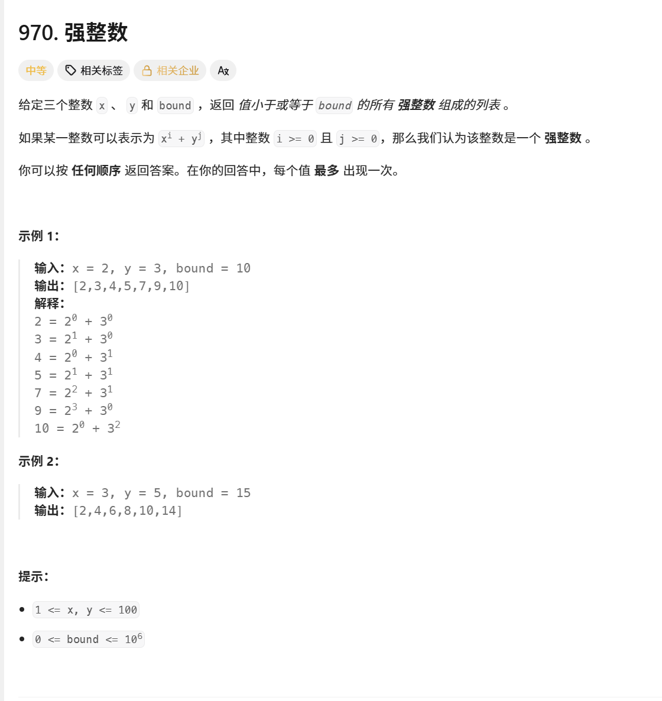
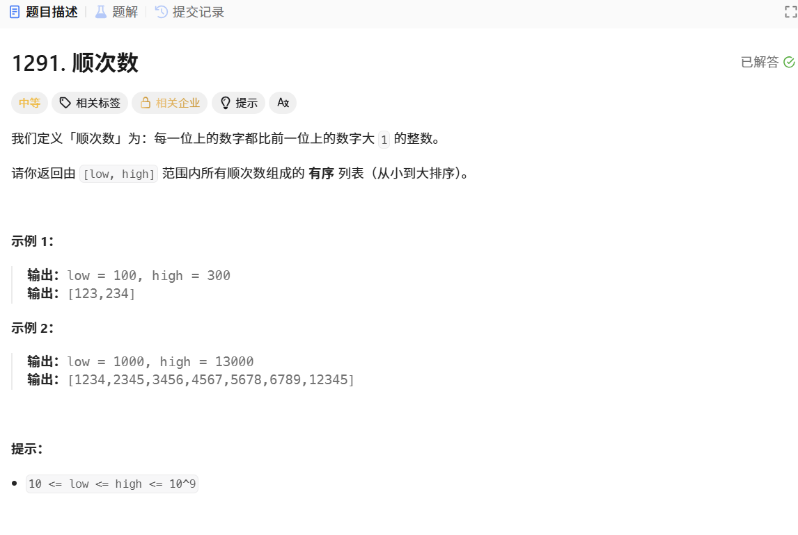
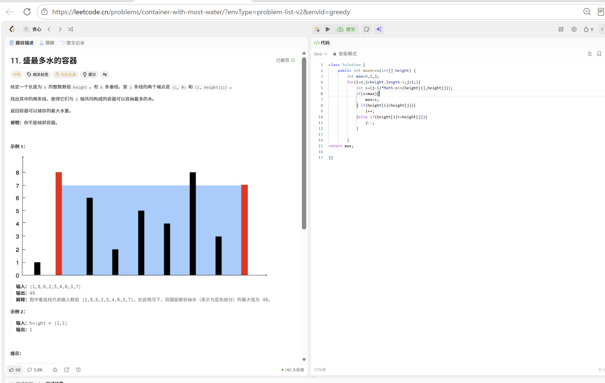

# leetcode-sulution算法题
455. ## 这道题是最简单的贪心思路，遍历g和s数组，比较g[i]与s[j],如果吃不了就换下一个饼干，如果能吃换下一个饼干换下一个小孩

---

1217. **这也是贪心思路，挑两个不耗费 钱，所以所有偶数的都回到2，奇数的都会到1，直接对二取余，判断是奇数还是偶数，然后在比较1跟2上谁少返回谁**
      

---

970.**这题需要暴力枚举法，遍历所有x的i次方与y的j次方（i，j的大小范围可以用2的20次方举例1e6，题中也给了bound的范围），需要注意的是x与y为1的情况，然后就是去重了，这题很简单**

---

1291.**这题啊想了半天想的思路错了，我想的是边遍历边判断，看了别人的题解才知道，应该直接遍历出那些数，然后再判断（当时卡这里了，一直想着数位分离了），下次多模拟模拟过程，还有一种方法是直接把那些数举出来然后判断，一开始也没想到，也就32个数**

---

11.**好久没写了好生疏，这题想了半天发现双循环会超时然后我实在想不出来问豆包了，点了我一下我就通了，双指针，先把两头i，j作为变量遍历然后求面积，然后短的往前移或者往后移因为长度已经是最大了，肯定是移短的，然后后面判断有点问题debug调试发现死循环了**

